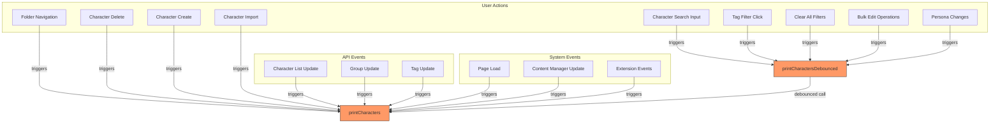
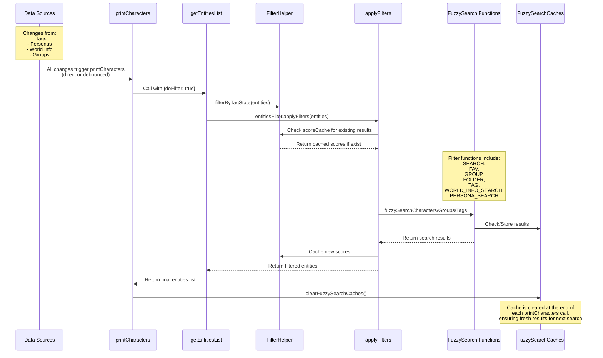

## Input Sources to printCharacters

`printCharacters` is the main function that triggers the fuzzy search process if fuzzy search is enabled.

This diagram shows how `printCharacters` is called throughout the application:

1. User Actions that trigger character list updates:
   - Search input (debounced)
   - Tag filter clicks (debounced)
   - Folder navigation (direct)
   - Character management operations (direct)

2. API Events that require list refresh:
   - Character list updates
   - Group updates
   - Tag system updates

3. System Events:
   - Initial page load
   - Content manager updates
   - Extension-triggered refreshes

## Fuzzy Search Flow

This diagram shows the flow of fuzzy search operations:

